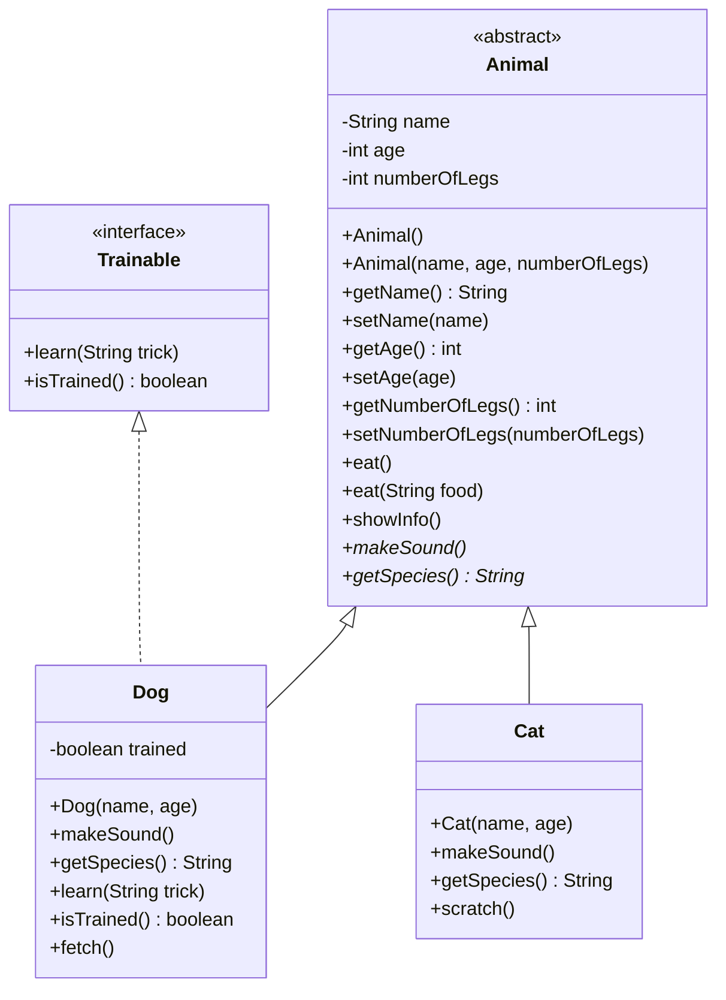

# Bài tập OOP: Hệ thống Quản lý Động vật 🐾

## Mục tiêu
Áp dụng đầy đủ **4 tính chất OOP** thông qua chủ đề Động vật.

---

## Kiến thức cần áp dụng

| # | Tính chất | Ý nghĩa | Bạn sẽ làm gì |
|---|-----------|----------|----------------|
| 1 | **Encapsulation** (Đóng gói) | Giấu dữ liệu, chỉ truy cập qua getter/setter | Dùng `private` cho các thuộc tính, tạo getter/setter |
| 2 | **Inheritance** (Kế thừa) | Lớp con kế thừa từ lớp cha | `Dog`, `Cat` kế thừa từ `Animal` |
| 3 | **Polymorphism** (Đa hình) | Cùng method, hành vi khác nhau | Override `makeSound()`, overload `eat()` |
| 4 | **Abstraction** (Trừu tượng) | Ẩn chi tiết, chỉ lộ interface | Abstract class `Animal` + Interface `Trainable` |

---

## Yêu cầu chi tiết

### Bước 1: Tạo Interface `Trainable`
📄 **File: `Trainable.java`**

Tạo interface với 2 method:
- `void learn(String trick)` — dạy động vật một trick
- `boolean isTrained()` — kiểm tra đã được huấn luyện chưa

---

### Bước 2: Tạo Abstract Class `Animal`
📄 **File: `Animal.java`**

Tạo abstract class với:

**Thuộc tính (phải dùng `private`)** — *Đây là Encapsulation*:
- `name` (String) — tên con vật
- `age` (int) — tuổi
- `numberOfLegs` (int) — số chân

**Constructor:**
- Constructor mặc định: gán `name = "Unknown"`, `age = 0`, `numberOfLegs = 4`
- Constructor có tham số: nhận `name`, `age`, `numberOfLegs`

**Getter / Setter:**
- Tạo getter/setter cho cả 3 thuộc tính
- Trong `setAge()`: kiểm tra nếu age < 0 thì gán = 0 (bảo vệ dữ liệu)

**Method cụ thể:**
- `void eat()` — in ra `"[name] is eating"`
- `void eat(String food)` — in ra `"[name] is eating [food]"` *(Đây là Overload — Polymorphism)*
- `void showInfo()` — in ra thông tin: tên, tuổi, số chân

**Abstract method** — *Đây là Abstraction*:
- `abstract void makeSound()` — mỗi con vật kêu khác nhau
- `abstract String getSpecies()` — trả về loài

---

### Bước 3: Tạo Class `Dog` (kế thừa Animal, implement Trainable)
📄 **File: `Dog.java`**

```
public class Dog extends Animal implements Trainable
```

**Thuộc tính thêm:**
- `private boolean trained = false`

**Constructor:**
- Nhận `name` và `age`, gọi `super()` với `numberOfLegs = 4`

**Override các method** — *Đây là Polymorphism (Override)*:
- `makeSound()` → in `"[name]: Woof! Woof!"`
- `getSpecies()` → return `"Dog"`

**Implement Trainable:**
- `learn(String trick)` → in `"[name] learned: [trick]!"`, set `trained = true`
- `isTrained()` → return giá trị `trained`

**Method riêng:**
- `void fetch()` → in `"[name] is fetching the ball!"`

---

### Bước 4: Tạo Class `Cat` (kế thừa Animal)
📄 **File: `Cat.java`**

> **Lưu ý:** Cat **KHÔNG** implement Trainable (vì mèo khó dạy 😄)

**Constructor:**
- Nhận `name` và `age`, gọi `super()` với `numberOfLegs = 4`

**Override các method:**
- `makeSound()` → in `"[name]: Meow~ Meow~"`
- `getSpecies()` → return `"Cat"`

**Method riêng:**
- `void scratch()` → in `"[name] is scratching the furniture!"`

---

### Bước 5: Tạo Class `Main` để kiểm tra
📄 **File: `Main.java`**

Trong `main()`, hãy viết code thực hiện các việc sau:

```java
// 1. Tạo 1 Dog tên "Buddy", 3 tuổi
// 2. Tạo 1 Cat tên "Kitty", 2 tuổi

// 3. Gọi showInfo() cho cả 2 con

// 4. Gọi makeSound() cho cả 2 con (thể hiện Polymorphism)

// 5. Gọi eat() và eat("bone") cho Dog (thể hiện Overload)
//    Gọi eat() và eat("fish") cho Cat

// 6. Dạy Dog một trick: "shake hands"
//    In ra kết quả isTrained()

// 7. Gọi method riêng: fetch() cho Dog, scratch() cho Cat

// 8. THỬ NGHIỆM: Tạo biến kiểu Animal nhưng gán Dog
//    Animal animal = new Dog("Rex", 5);
//    Gọi animal.makeSound() → xem kết quả

// 9. THỬ NGHIỆM: set age = -5, sau đó getAge() xem kết quả
```

---

## Kết quả mong đợi (tham khảo)

Khi chạy xong, output sẽ trông tương tự như:

```
=== Animal Info ===
Name: Buddy | Age: 3 | Legs: 4
Name: Kitty | Age: 2 | Legs: 4

=== Sounds ===
Buddy: Woof! Woof!
Kitty: Meow~ Meow~

=== Eating ===
Buddy is eating
Buddy is eating bone
Kitty is eating
Kitty is eating fish

=== Training ===
Buddy learned: shake hands!
Is Buddy trained? true

=== Special Actions ===
Buddy is fetching the ball!
Kitty is scratching the furniture!

=== Polymorphism Test ===
Rex: Woof! Woof!

=== Encapsulation Test ===
Age after setAge(-5): 0
```

---

## Sơ đồ quan hệ các class



---

## Cấu trúc thư mục

```
Exercise/
├── Trainable.java      ← Interface (Abstraction)
├── Animal.java         ← Abstract class (Abstraction + Encapsulation)
├── Dog.java            ← Kế thừa Animal + implement Trainable
├── Cat.java            ← Kế thừa Animal
└── Main.java           ← Test tất cả
```

---

## Gợi ý

> [!TIP]
> Hãy so sánh với bài Car bạn đã làm:
> - `Car` ↔ `Animal` (abstract class)
> - `CarMethod` ↔ `Trainable` (interface)
> - `Honda`, `Bmw` ↔ `Dog`, `Cat` (lớp con)
> - `engineType()` overload ↔ `eat()` overload

> [!IMPORTANT]
> Điểm **mới** so với bài Car: Bài này yêu cầu dùng **`private` + getter/setter** (Encapsulation).
> Trong bài Car, bạn để `brand` là package-private. Lần này hãy thử dùng `private` đúng cách.

---
